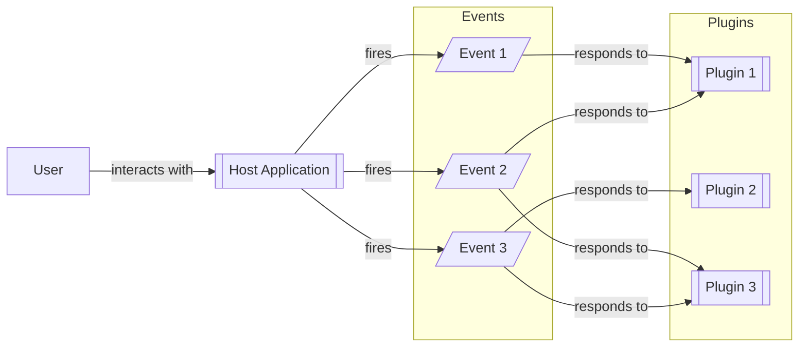

# What is a Plugin?

Sometimes you want to enable the expansion of features in a software, but don't want to modify the software every time 
you want to add functionality. Maybe the new functionality needs to be optional Other times, it may be better to have 
functionality maintained independently. A plugin architecture allows the developer to modularize functionality by
creating a separation between **events** (when something happens) and **response** what happens as a result.

In a plugin architecture, the **Host Application** implements some functionality that the user directly interacts with.
For instance, a web browser provides GUI controls for going backwards, forwards, reloading the page, or clicking links.
These activities generate **events**, or signals that something has happened. **Plugins** can respond to these events, 
performing some activity.

Plugins are designed to be optional (they can be there or not be there, and the host application still works). A host
application need only discover the load the plugins, provide a mechanism to allow plugins to associate themselves with
events, and then fire the events when the action occurs.

